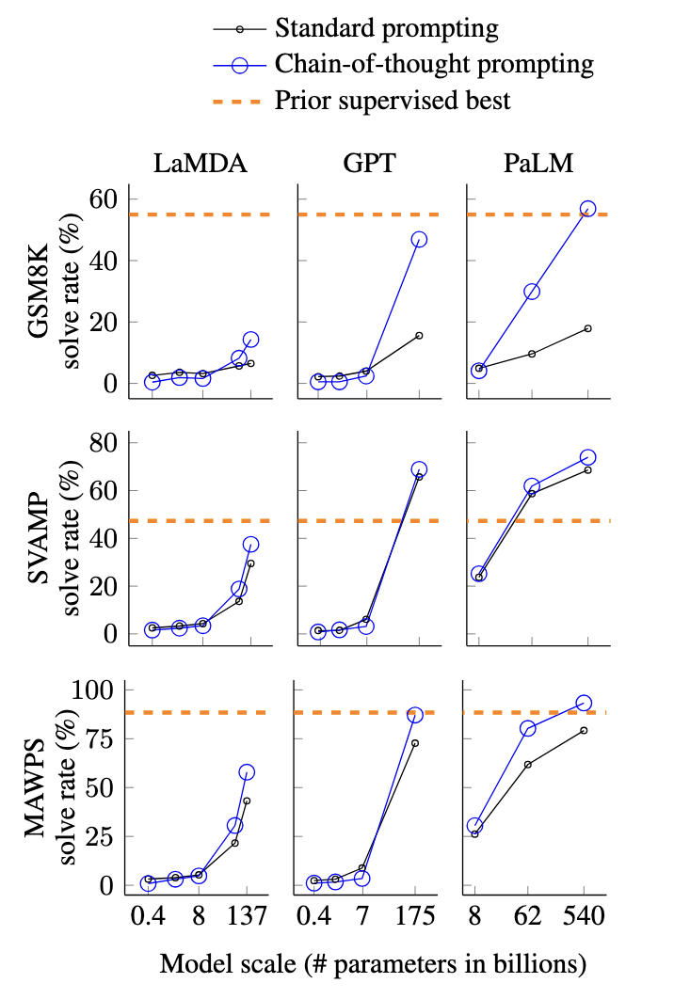
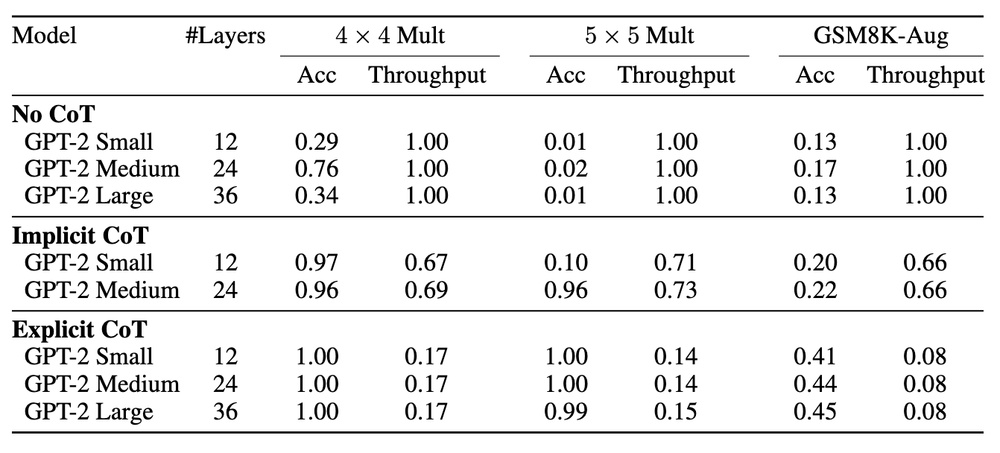

Language models (LM) trained on next-token prediction have exhibited impressive performance on a wide variety of tasks, from language modeling to code generation to translation. Very large language models (LLMs), some with over a trillion parameters, have been shown to solve basic reasoning tasks, like arithmetic and state tracking. Smaller models, however, continue to struggle with these tasks, even state-of-the-art models when tasked with grade-school arithmetic.


As LMs increasingly integrate into our daily lives, two orthogonal optimization goals have emerged: increasing the accuracy of the model on complex reasoning tasks and decreasing the computational cost of inference, which is critical for running models on lower-powered devices like personal computers and smartphones. Few people carry H100s in their pockets, but we all carry phones!


There are (at least!) two means for decreasing the computational cost of inference in reasoning tasks:


1. **Decrease the size of the model**
   - Quantize the model (using low-floating-point arithmetic)
   - Use model compression techniques
   - *Prune* the model (remove parameters)
2. **Decrease the total number of computations**
   - Encourage the LM to generate fewer tokens during reasoning
   - Force the LM to skip certain steps in its forward pass


In this blog post, we will address both of these goals by describing joint work-in-progress with Belinda Li on 1) structured pruning of LMs and 2) *continuous chain-of-thought* prompting.


# *Aide-mémoire* on Language Models


While we assume basic familiarity with the transformer architecture in this blog post, we provide a brief overview for convenience and to set notation.

- language model
- transfomer language model


> **Definition 1** 
> For our purposes, a **language model (LM)** is a neural network that takes as input a sequence of *tokens* and outputs a next-token prediction. An LM consists of three components:
>1. An **embedding layer** that maps tokens to vectors in some fixed-dimensional vector space, of dimension far smaller than the vocabulary size.
>2. A stack of **attention layers**, each consisting of a handful of attention heads and a feed-forward layer.
>3. A **projection layer** that maps the output of the final attention layer to a vector in the vocabulary space.
>
> We will write $\vec{x} = (x_1, x_2, \dots, x_t)$ to denote a sequence of tokens, $\vec{x}_{<t} = (x_1, x_2, \dots, x_{t-1})$ to denote the sequence of tokens excluding the last one, and $p(x_t \mid \vec{x}_{<t})$ to denote the probability of the next token given the previous tokens. For the sake of concision, we will write $\mathcal{N}_i(\vec{x})$ to denote the $i$-th next-token prediction of the LM for the sequence $\vec{x}$.
>
> This is defined recursively: given the $i$-th next-token prediction $\mathcal{N}_i(\vec{x})$, the $(i+1)$-th next-token prediction $\mathcal{N}_{i+1}(\vec{x})$ is defined as
>
> $$\mathcal{N}_{i+1}(\vec{x}) = \mathcal{N}_1\left(x_1, \dots, x_t, \mathcal{N}_1(\vec{x}), \dots, \mathcal{N}_i(\vec{x})\right)$$


> **Aside**
>
> In this post, we will only be considering *autoregressive* LMs, those trained on next-token prediction, and not models trained on masked language modeling (like BERT).


## Attention


**Attention**, specifically self-attention, is the backbone of LMs, allowing them to learn dependencies between any two tokens in a sequence. For a lucid exposition of the attention mechanism, see [The Illustrated Transformer](https://jalammar.github.io/illustrated-transformer/). For the purposes of this blog post, we will only need the following:


> **Definition 2**
>
> - An **attention head** consists of a *query* matrix $W^{(q)}$, a *key* matrix $W^{(k)}$, and a *value* matrix $W^{(v)}$, each with dimension $d \times d$, where $d$ is the embedding dimension of the model.
> - Given an input matrix $X$ of dimension $n \times d$ (corresponding to a sequence of $n$ tokens), the attention head computes matrices
>   - $Q = XW^{(q)}$
>   - $K = XW^{(k)}$
>   - $V = XW^{(v)}$
>   of dimension $n \times d$.
> - It then computes the **scaled dot-product attention** of $Q$, $K$, and $V$ as
> $$
> \textsf{Attention}(Q, K, V) = \textsf{softmax}\left(\frac{QK^\top}{\sqrt{d}}\right)V
> $$
> - A model may contain multiple attention heads $h_1, \dots, h_H$, computed in parallel, the outputs of which are then concatenated to form a single *multi-head attention* tensor $\textsf{MHA}(X)$.


> **Definition 3**
>
> An **attention layer** consists of
> - A stack of attention heads $h_1, \dots, h_H$ for some integer $H$, combining to give a multi-head attention block $\textsf{MHA}_{h_1, \dots, h_H}(X)$
> - A feed-forward layer $\textsf{MLP}(Y)$, often taken to have one hidden layer.
>
> The forward pass of the complete attention layer is given by
> $$
> \textsf{MLP}(\textsf{LayerNorm}(\textsf{MHA}_{h_1, \dots, h_H}(\textsf{LayerNorm}(X)))) + X~,
> $$
> where $\textsf{LayerNorm}$ is some form of layer normalization and $X$ is added onto the end as a *residual stream*.


While the majority of the parameters in an LM are in the transformer layer MLPs, as sequence length grows, the attention heads become the most computationally intensive component of the model. 


# Structured Pruning


For years, it has been known that neural networks have extensive redundancy in their weights ([Le Cun et al. (1990)](https://proceedings.neurips.cc/paper_files/paper/1989/file/6c9882bbac1c7093bd25041881277658-Paper.pdf), [Han et al. (2015)](https://arxiv.org/pdf/1506.02626), [Frankle and Carbin (2019)](https://arxiv.org/pdf/1803.03635)), and that pruning these weights can lead to significant gains in efficiency with little-to-no loss in accuracy. Not all weights in a network are used as frequently as others in a given forward pass: 

[TODO: mention that redundancy comes from training]


# Chain-of-Thought Prompting


One of the most successful strategies for improving LM reasoning ability has been to prompt the model to reason through tasks step-by-step, with a series of intermediate reasoning steps. This makes intuitive sense for models trained on next-token-prediction: by performing small steps bit-by-bit, essentially tracking the state of the task, the model is more likely to maintain an accurate representation of the task at hand.


Chain-of-thought prompting was first introduced in a [landmark paper](https://arxiv.org/pdf/2201.11903) by Wei et al. in 2022. Therein, the authors demonstrate on multiple LMs of multiple sizes that training a model to verbalize its reasoning can lead to significant gains in reasoning ability on certain complex reasoning tasks.


<div style="display: flex; align-items: center; margin-bottom: 20px;">
 <div style="margin-right: 20px; flex-shrink: 0; width: 30%; font-size: 0.9em;">
   <strong>Figure 1:</strong> Summary of results from Wei et al. (2022). They study three different datasets including GSM8K (a dataset of grade-school math word problems) with three groups of models of varying sizes. Their results show that CoT prompting leads to significant reasoning gains on larger models when reasoning about tasks that scale roughly linearly.
 </div>
 <div>
   
 </div>
</div>


While these results are indicative of greater possibilities for LMs, they are incomplete: rather than fine-tuning the models to get better at reasoning, the authors merely prompt the model to reason by providing a series of templates for it to base its reasoning on. This perhaps explains why the gains are most significant on larger models, which are better able to make use of the reasoning cues.


Could we perhaps fine-tune models on reasoning chains to better improve their task-specific reasoning ability? [Nye et al. (2021)](https://arxiv.org/abs/2112.00114) began to explore this possibility, by training a model to generate specifically-formatted reasoning chains. They teach models to use a "scratchpad" to show their work, training them step-by-step to verbalize the correct reasoning chains. At a high level, their curriculum trains models to be able to generate correct reasoning chains bit-by-bit: as the epochs progress, the model is tasked with generating a larger proportion of the chain, working backwards.


> **Example Prompt and Reasoning**
>
> Q: Roger has 5 tennis balls. He buys 2 more cans of tennis balls. Each can has 3 tennis balls. How many tennis balls does he have now?
>
> Scratchpad:
> 1. Roger has 5 tennis balls.
> 2. He buys 2 more cans of tennis balls.
> 3. Each can has 3 tennis balls.
> 4. He has 5 + 2 = 7 cans of tennis balls.
> 5. He has 7 cans * 3 tennis balls/can = 21 tennis balls.
>
> A: 21


They begin the curriculum by training the model to generate the answer—21 in this case—given the entirety of the reasoning chain. Stage-by-stage, they delete the final tokens of the reasoning chain and train the model to fill in the remaining tokens and generate the correct answer.


The accuracy gains were significant: with 9-digit addition, they were able to achieve 96% accuracy with a 1B parameter model, compared to near 0% accuracy without the scratchpad.


While their results showcase the impressive accuracy gains possible from training a model to generate better reasoning chains, the computational cost of CoT inference is still high, requiring more extensive token-generation than standard prompting. Recent work has begun to address this issue from two directions: teaching a model to *internalize* its CoT process and foregoing the generation of tokens altogether, feeding the last layer's activations directly back into the first layer of the model, allowing it to reason *continuously* in latent space (this is a concept we will return to later).


## Internalizing Chain-of-Thought


Humans are very good at reasoning *without* explicitly verbalizing our reasoning steps. Some may consider this "intuition", an aspect of intelligence common to nearly all animals, but one that is quite challenging to formalize, and hence quite difficult to teach to LMs. Rather than training a model to output explicit reasoning chains, we could instead imagine training a model to *internalize* its CoT process, removing reasoning steps throughout the training process.


This is precisely what [Deng et al. (2023)](https://arxiv.org/pdf/2311.01460) and [Deng et al. (2024)](https://arxiv.org/pdf/2405.14838v1) investigated in their papers "Implicit Chain-of-Thought Reasoning via Knowledge Distillation" and "From Explicit CoT to Implicit CoT: Learning to Internalize CoT Step by Step". Both papers explore different ways to have models internalize their CoT process, theoretically allowing them to solve tasks that have required CoT without the additional token generation overhead. Via [knowledge distillation](https://arxiv.org/abs/2402.13116), they are able to achieve nearly identical performance to explicit CoT prompting with nearly 5x faster inference.


<div style="display: flex; align-items: center; margin-bottom: 20px;">
 <div style="margin-right: 20px; flex-shrink: 0; width: 30%; font-size: 0.9em;">
   <strong>Figure 2:</strong> Summary of results from Deng et al. (2023). They study GSM8K, 4-digit multiplication, and 5-digit multiplication. They compare reasoning without CoT (No-CoT), with explicit CoT, and with implicit CoT via knowledge distillation.
 </div>
 <div>
   
 </div>
</div>


In the absence of a suitable "teacher" LM for knowledge distillation, it would be helpful to have a different method for training a model to internalize its CoT process. Deng et al. (2024) in their follow-up work implement a curriculum to train models to internalize their thought processes step-by-step, allowing them to interpolate between fully-explicit and fully-implicit CoT. This curriculum achieves better accuracy than knowledge distillation (ICoT-KD), among other benefits. The authors summarize the benefits of stepwise-internalized ICoT as follows:


> Compared to ICoT-KD, Stepwise Internalization has three advantages:
> First, it is simpler to implement as it does not require a teacher model. Second, while ICoT-KD
> internalizes reasoning into a single "column" of states (corresponding to the final input position),
> Stepwise Internalization allows the model to internalize reasoning across all input positions. Lastly,
> Stepwise Internalization achieves better accuracy compared to ICoT-KD.


# Brainstorm


- Sources:
   - [Chain-of-Thought Prompting](https://arxiv.org/abs/2201.11903)
       - Demonstrates that a LM verbalizing its reasoning can solve tasks that it is as yet unable to solve using standard prompting.
   - [Implicit Chain-of-Thought](https://arxiv.org/abs/2405.14838v1)
       - Trains LMs to internalize their chain-of-thought process, allowing them to solve tasks that often require chain-of-thought without the additional token generation overhead.
   - [Attention pruning](https://arxiv.org/abs/2110.03252)
       - Attention heads are often redundant. While the majority of LM parameters are in the MLPs, selectively pruning attention heads can lead to speedups in inference.
   - [Layer pruning](https://arxiv.org/abs/2403.17887)
       - Pruning entire layers of a LM can lead to significant gains in efficiency, though often at a greater performance cost (but not extreme!).
   - [Continuous CoT](https://arxiv.org/abs/2412.06769)
       - LMs are trained on next-token prediction. After the first token is generated, the LM then takes in the entire prompt and the generated tokens so far, re-embeds them, and processes them again. The idea of *continuous CoT* (coconut) is to input the last layer's activations back into the first layer of the model, circumventing the unembed—embed step.
       - In doing so, the LM can reason *continuously* in latent space, rather than "quantizing" its reasoning into a discrete set of tokens. As a result, coconut allows LMs to reason more accurately than standard CoT with significant efficiency gains.
- Brief overview of the LM transformer architecture (decoder-only)
- Discussion of CoT prompting
   - Introduce the GSM8K dataset
   - Give example of CoT training data for GSM8K
   - Present empirical results showing accuracy gains from CoT
- Structured Pruning
   - Discuss redundancy in LMs and model compression
   - Discuss redundancy in attention heads and results about pruning attention heads
   - Discuss layer pruning and results
       - Tactics for determining which layers to remove (e.g. cosine similarity, accuracy on a validation set, angular block deletion)
- Continuous CoT
   - Discuss how it works (pictures if possible!)
   - Discuss training methodology
   - Present coconut results
- Combining structured pruning and continuous CoT
   - Discuss experimental setup
       - Llama 3.2 1b
       - GSM8K
       - Layer pruning results before fine-tuning
       - Attention head importance and pruning results before fine-tuning
- Discuss upcoming work


Transformer-based language models (LMs) have exploded in popularity since their [introduction in 2017](https://arxiv.org/abs/1706.03762). As language models have grown in size—from hundreds of millions of parameters to billions and now trillions—training and inference costs have skyrocketed. Despite their impressive performance, LMs (particularly smaller ones)still struggle with tasks that require complex reasoning. One of the most successful strategies for improving LM performance is **chain-of-thought (CoT) prompting**. At its most basic, CoT involves prompting a LM to reason through a task step-by-step, often with a series of intermediate reasoning steps.


Transformer layer:
$$
\textsf{Attention}(Q_i, K_i, V_i) = \textsf{softmax}\left(\frac{Q_iK_i^\top}{\sqrt{d}}\right)V_i
$$


In this blog post, we will describe some methods for improving the efficiency of LM inference—structured pruning and *continuous CoT*—and discuss work-in-progress on combining them.


# Chain-of-Thought Prompting


We assume a basic familiarity with the transformer architecture. Recall that a standard (decoder-only) transformer consists of a stack of *layers*, each containing a block of *attention heads* and a feed-forward layer. [finish]


# Experimental Setup


In our preliminary explorations of pruned CoConuT, we work with Llama 3.2 1B, a state-of-the-art LM lightweight enough to run and be fine-tuned on a single GPU. We use the [Hugging Face](https://huggingface.co/meta-llama/Llama-3.2-1B-Instruct) implementation of Llama 3.2 1B running on a single Nvidia A100 GPU.


## Overview of the Llama 3.2 1B architecture


Llama 3.2 1B is a decoder-only transformer, consisting of an embedding layer, a stack of 16 `LlamaDecoderLayer`s with layer normalization, and a final "LM head" projection layer. Each `LlamaDecoderLayer` contains a self-attention sublayer with 32 attention heads, a feed-forward sublayer `LlamaMLP` with `hidden_size=2048`, `intermediate_size=8192`, and `act_fn=silu`, giving a total of $2048 \times 8192 \times 2 + 8192 \times 2048 = 50,331,648$ parameters in the MLP sub-layer.


```python
class LlamaMLP(nn.Module):
   def __init__(self, config):
       super().__init__()
       self.config = config
       self.hidden_size = config.hidden_size
       self.intermediate_size = config.intermediate_size
       self.gate_proj = nn.Linear(self.hidden_size, self.intermediate_size, bias=config.mlp_bias)
       self.up_proj = nn.Linear(self.hidden_size, self.intermediate_size, bias=config.mlp_bias)
       self.down_proj = nn.Linear(self.intermediate_size, self.hidden_size, bias=config.mlp_bias)
       self.act_fn = ACT2FN[config.hidden_act]


   def forward(self, x):
       down_proj = self.down_proj(self.act_fn(self.gate_proj(x)) * self.up_proj(x))
       return down_proj
```


Each attention head has query matrix of dimension $2048 \times 2048$, key matrix of dimension $2048 \times 512$, and value matrix of dimension $2048 \times 512$, for a total of $2048 \times 2048 + 2048 \times 512 + 2048 \times 512 + 2048 \times 2048 = 12,582,912$ parameters in the attention sub-layer.


```python
LlamaAttention(
 (q_proj): Linear(in_features=2048, out_features=2048, bias=False)
 (k_proj): Linear(in_features=2048, out_features=512, bias=False)
 (v_proj): Linear(in_features=2048, out_features=512, bias=False)
 (o_proj): Linear(in_features=2048, out_features=2048, bias=False)
)
```
These combine to give a total of $16 \times (12,582,912 + 50,331,648) = 1,006,633,024$ parameters in the model.


> **Remark**
>
> The Llama 3.2 1B architecture utilizes a lightweight variant of multi-head attention called **Grouped Query Attention (GQA)** ([Ainslie et al. (2023)](https://arxiv.org/pdf/2305.13245)), wherein key and value matrices are shared across groups of query matrices. This can help greatly with the large memory requirements of multi-head attention, without enormous losses in performance.
> This explains why `q_proj` and `k_proj` have different dimensions in the `LlamaAttention` module: across 32 attention heads, there are 32 query matrices (with hidden dimension $2048 \div 32 = 64$), but only 8 key and value matrices (with hidden dimension $512 \div 8 = 64$).
>
> GQA can help greatly with the large memory requirements of multi-head attention, with only small losses in accuracy. Ainslie et al. (2023) show that GQA with $H / 8$ groups can reduce the time per sample by nearly 90% while losing marginal accuracy.